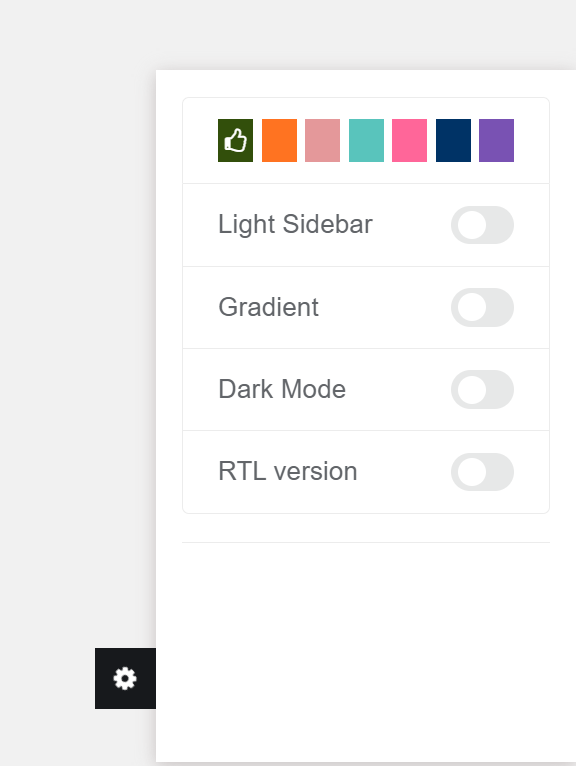
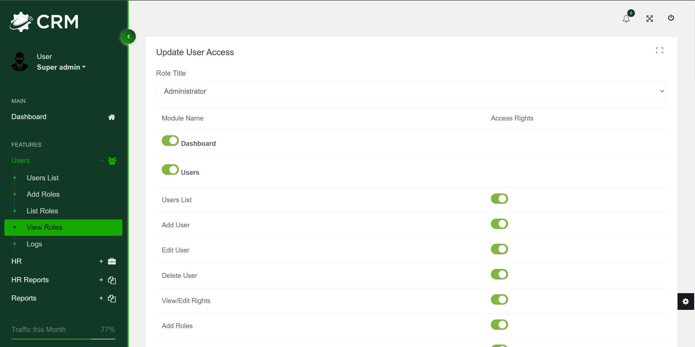
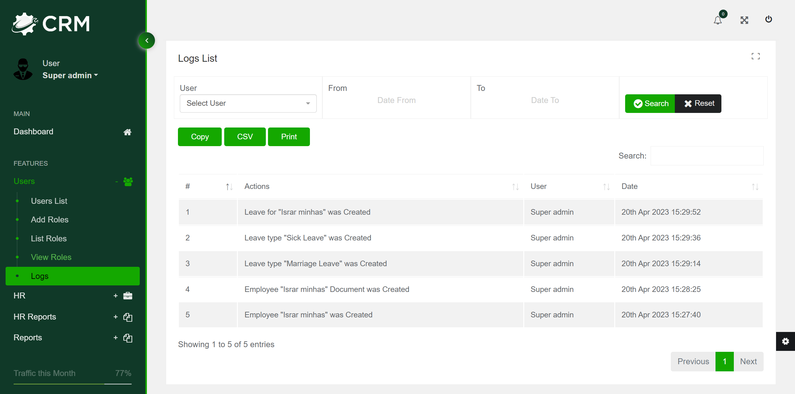

<p align="center">
  
</p>
<h1>CRM</h1>
The CRM is a comprehensive web-based project developed using Laravel that incorporates a wide range of functionalities related to the HR module. It facilitates the management of employee information, attendance records, leaves, and payroll processing. The project provides an easy-to-use interface for adding and managing employee details, capturing attendance information, and processing leaves. Additionally, it generates informative and visually appealing reports that help users gain insights into different aspects of HR management. The system's ability to present data in a meaningful way makes it an efficient tool for HR professionals looking to streamline their operations and make informed decisions.

<h2>Requirements</h2>
To install the Job Board API, you will need to have PHP version 8.0 or greater installed on your computer. You can check your current PHP version by running the following command in your terminal:

```shell
php -v
```

If you don't have PHP installed or need to upgrade to the required version, you can download it from the official PHP <a href="https://www.php.net/downloads.php">website</a>.

Next, you will need to install Composer, a dependency manager for PHP, which you can download from the official Composer <a href="https://getcomposer.org/download/">website</a>. Once installed, you can navigate to the project directory in your terminal and run the following command to install the required dependencies:
```shell
composer install
```

XAMPP is required to install and run the Job Board API locally. It provides the necessary environment to run PHP applications, including a web server, a database, and PHP itself. XAMPP is available for Windows, macOS, and Linux and can be downloaded from the Apache Friends <a href="https://www.apachefriends.org/">website</a>.

<h2>Installation</h2>

1. Clone the repository:

```shell
git clone https://github.com/Israrminhas1/CRM.git
```
2. Access the directory:

```shell
cd CRM/
```

3. Install the composer dependencies:

```shell
composer install
```

4. Create the database `crm` 
5. Create a file `.env` and add configuration:

6. Generate App Key

```
php artisan key:generate
```

7. Migrate Database Table

```shell
php artisan migrate
```
8. Seed Database Table
```shell
php artisan db:seed
```
9. Run the application
```shell
php artisan serve
```
10. Login Credentials
email: admin@admin.com
password: admin123
<h2>Dashboard Theme</h2>
The Project succesfully use <a href="https://preview.themeforest.net/item/mooli-laravel-html-admin-dashboard-template/full_screen_preview/26800373?_ga=2.121220168.1923719563.1681929282-1550340208.1680948019">mooli</a> theme provided by themeforest.<br><br>
  <br>
The Dark Green Color theme is customly added,
You can switch between different theme colors by setting button on bottom right and connected it with database so each user have their own saved theme settings (color, darkmode etc). <br><br>
 <br>
 <h2>Features</h2>
 <h3>User roles and access control</h3>
The User roles and access control in the CRM project offers complete control over the roles and access of users. With this feature, you can create new roles for your users and assign access to them as per your requirements. This ensures that each user has separate rights and access based on their role within the organization, which helps to maintain data security and confidentiality. With this level of control, you can ensure that only authorized personnel have access to sensitive information and functions.
<br><br>
 <br>
<h3>Activity Log</h3>
The Activity Log feature of our project provides a comprehensive record of all user activities. This means that each time a user performs an action within the system, the details of the action, including the user responsible for it, are logged and stored in a secure database. With this feature, the admin can easily monitor all user activity and ensure that the system is being used in an appropriate and secure manner. Additionally, this feature provides valuable information for auditing purposes, which can be used to investigate any issues that may arise.
<br><br>
 <br>
<h3>Reporting</h3>
The Reports section of our project offers valuable insights into various aspects of the HR module. With the help of this section, users can easily analyze important information such as payroll payslip details, timesheet reports, attendance summaries, monthly attendance, and employee reports. Our project makes it easy for users to view and manage this information in an organized and user-friendly manner, helping them make informed decisions based on the data at hand. With our Reports section, users can gain a deeper understanding of their HR operations, identify areas of improvement, and optimize their payroll and attendance management processes.<br><br>
 <br>
